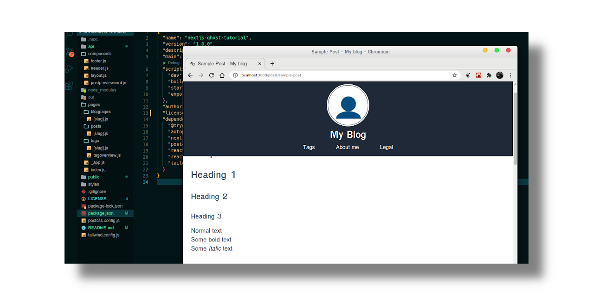

# nextjs-ghost-tutorial
Codebase for a tutorial on how to create a [Next.js](https://nextjs.org/) frontend for [ghost](https://ghost.org/), a headless Content Management System (CMS).<br/>
The article series can be seen under [https://filipe-matos.netlify.app](https://filipe-matos.netlify.app)




## Usage

```bash
mkdir somedirectory
cd ./somedirectory
git clone https://github.com/GitHubFilipe/nextjs-ghost-tutorial.git
cd ./nextjs-ghost-tutorial
npm run install
npm run dev
```

Browse [http://localhost:3000](http://localhost:3000) 
<br/><br/>

## Manual Sections

* [Episode 1 - Intro](https://filipe-matos.netlify.app/posts/nextjs-ghost-1-intro)
* [Episode 2 - Setting up the development environment](https://filipe-matos.netlify.app/posts/nextjs-ghost-2-setup-dev-env)
* [Episode 3 - Creating Next.js project and code repository](https://filipe-matos.netlify.app/posts/nextjs-ghost-3-create-nextjs-project)
* Episode 4 - Styling with Vanilla CSS and Tailwind
* Episode 5 - Creating pages and layout components
* Episode 6 - Speaking with Ghost(s)
* Episode 7 - Rendering blog posts
* Episode 8 - Rendering blog pages and tags
* Episode 9 - Build, export and publish
* Episode 10 - Search Engine Optimization (SEO)
<br/><br/>

## Feedback

Go to [GitHub Discussions](https://github.com/GitHubFilipe/nextjs-ghost-tutorial/discussions) for feedback.


<br/>

## License
nextjs-ghost-tutorial is licensed under the [MIT License](LICENSE)